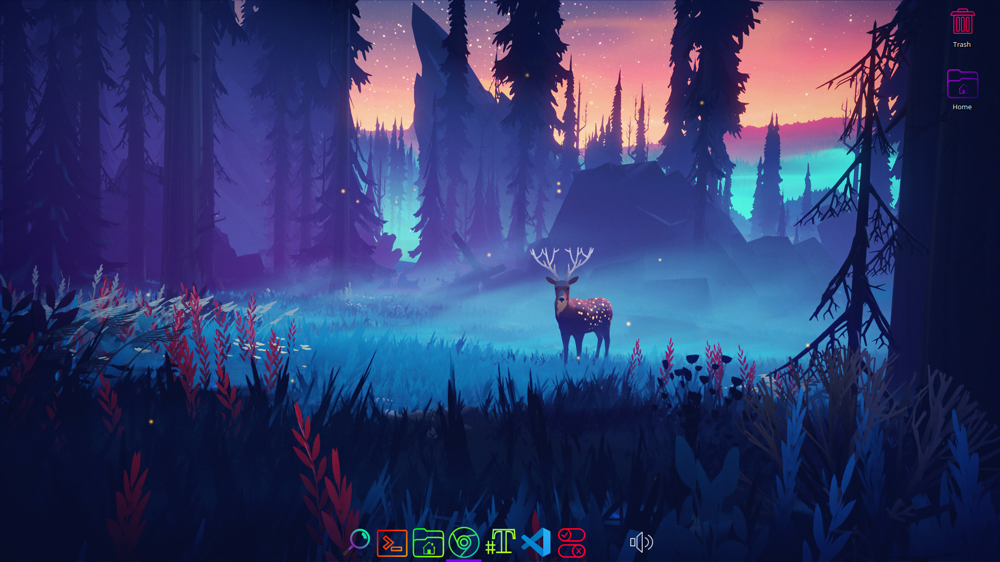
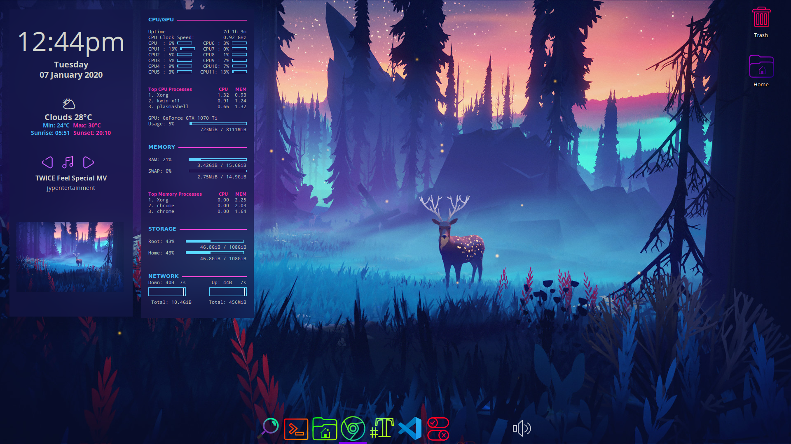
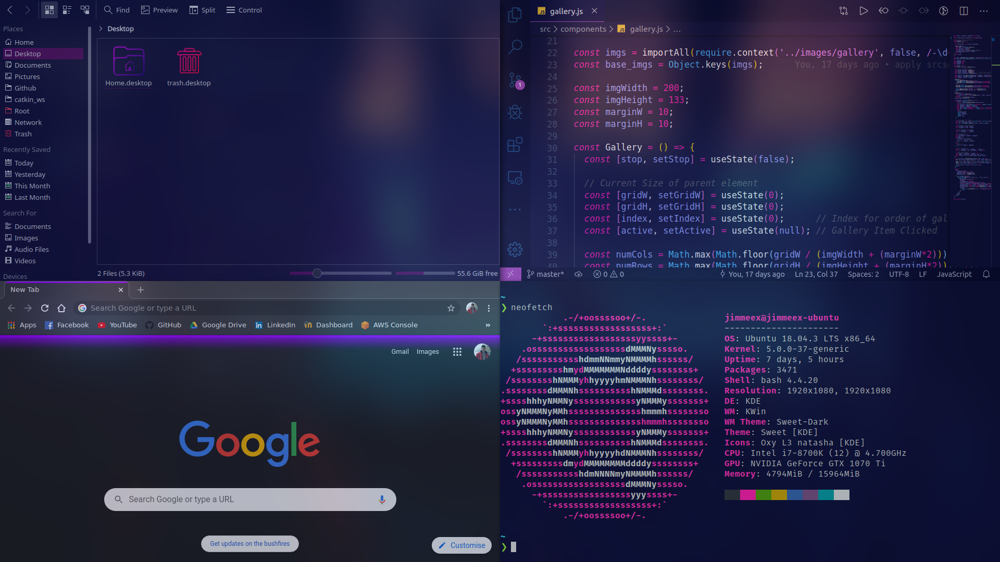

# My Desktop

## General Details

- OS: [Ubuntu 18.04 LTS](https://ubuntu.com/download/desktop)
- Wallpaper: [original](https://www.artstation.com/artwork/nA9Lr). Credits to [Mikael Gustafsson](https://www.instagram.com/mklgustafsson/)
- Desktop Environment: KDE Plasma 5
- Browser: Google Chrome
- Terminal: GNOME
- Theme: [Sweet KDE](https://www.pling.com/p/1294729/)
- Icons: Used various, mainly [OieIcons](https://www.pling.com/p/1299058/)
- Dock: [Latte](https://store.kde.org/p/1169519/)

## Apps & Config
- [Compton](https://github.com/tryone144/compton): Compositor. I mostly used it for the blurring effect. See [my config](https://github.com/JimmeeX/my_desktop/blob/master/compton/compton.conf)
- [Conky](https://github.com/brndnmtthws/conky): System activity monitor
    - Weather API: [OpenWeather](https://openweathermap.org/).
    - Music: Prioritises Media via Google Chrome & Spotify (since that's what I mainly use). Untested with other Media applications.
    - See [my config](https://github.com/JimmeeX/my_desktop/tree/master/conky). It includes a script to launch on startup, and a script to toggle on/off.
    - Code is forked from [here](https://github.com/amhndu/conky-cards), with [this](https://github.com/woohgit/conkySimpleForecast) to help with the OpenWeather API.
- [Visual Studio Code](https://code.visualstudio.com/): IDE
    - Theme: [1984](https://marketplace.visualstudio.com/items?itemName=juanmnl.vscode-theme-1984)
- GNOME Terminal: see [my bash config](https://github.com/JimmeeX/my_desktop/blob/master/terminal/.bashrc)
    - [tmux](https://github.com/tmux/tmux): [see config](https://github.com/JimmeeX/my_desktop/blob/master/terminal/tmux/.tmux.conf). I mostly use it for the split-screen functionality.
    - [starship](https://starship.rs/): Simple and minimalistic.
    - [neofetch](https://github.com/dylanaraps/neofetch): Command-line system information.
    - [fzf](https://github.com/junegunn/fzf): Command-line fuzzy finder
    - [gotop](https://github.com/cjbassi/gotop): Graphical activity monitor

## Inspirations
- [Neon 80s](https://www.reddit.com/r/unixporn/comments/c0i8e1/i3gaps_neon_80s/) (colour theme, blurring)
- [Mechanical Love](https://www.reddit.com/r/unixporn/comments/a900p7/awesome_mechanical_love/) (conky)
